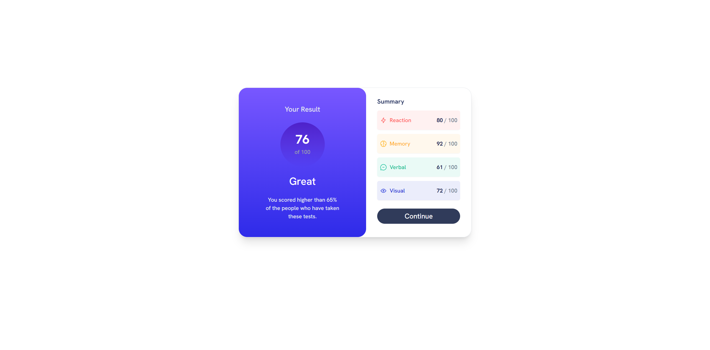

# Frontend Mentor - Product preview card component solution

This is a solution to the [Product preview card component challenge on Frontend Mentor](https://www.frontendmentor.io/challenges/product-preview-card-component-GO7UmttRfa). Frontend Mentor challenges help you improve your coding skills by building realistic projects. 

## Table of contents

- [Overview](#overview)
  - [The challenge](#the-challenge)
  - [Screenshot](#screenshot)
  - [Links](#links)
- [My process](#my-process)
- [Author](#author)

## Overview

### The challenge

Users should be able to:

- View the optimal layout depending on their device's screen size
- See hover and focus states for interactive elements

### Screenshot

### Links

- Solution URL: [Frontend Mentor Submission]()
- Live Site URL: [Live Site](https://product-preview-card-fm.web.app/)

## My process

- [Vuejs](https://vuejs.org/) - JS library
- Tailwind CSS
- Semantic HTML5 markup
- CSS custom properties
- Flexbox
- Mobile-first workflow

## Author

- Website - [Rohan Sirohia](https://www.linkedin.com/in/rohan-sirohia/)
- Frontend Mentor - [@RohanTrix](https://www.frontendmentor.io/profile/RohanTrix)
- Github - [@RohanTrix](https://github.com/RohanTrix/)
